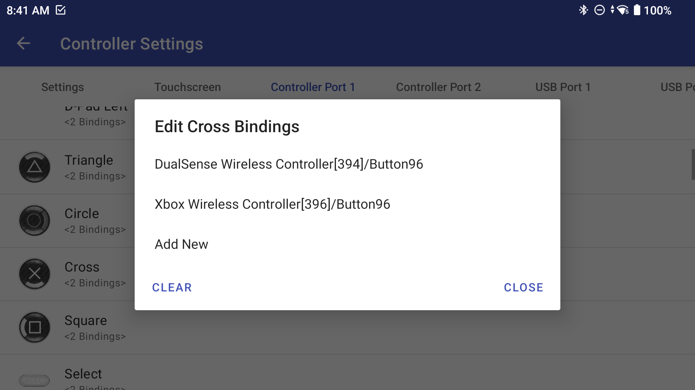
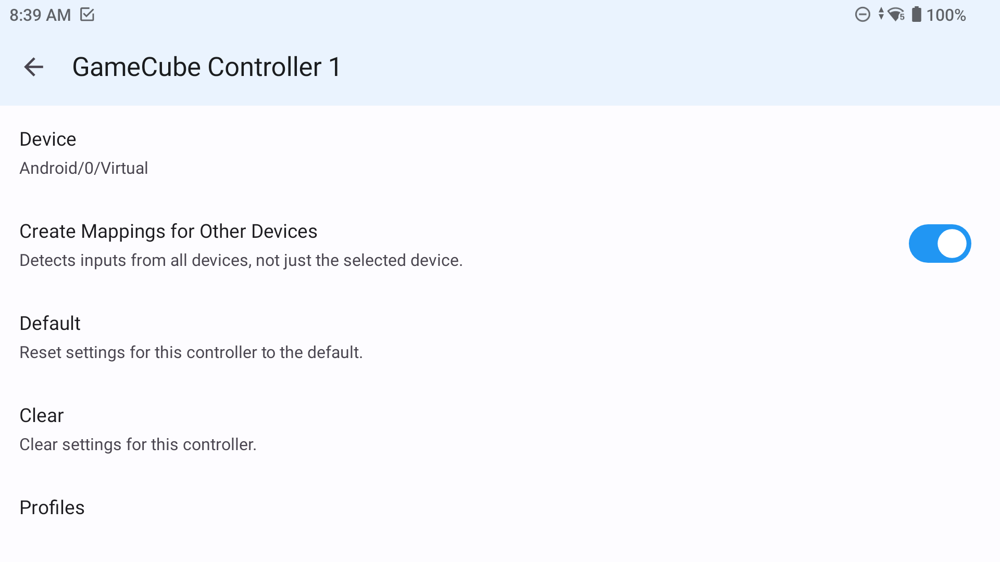
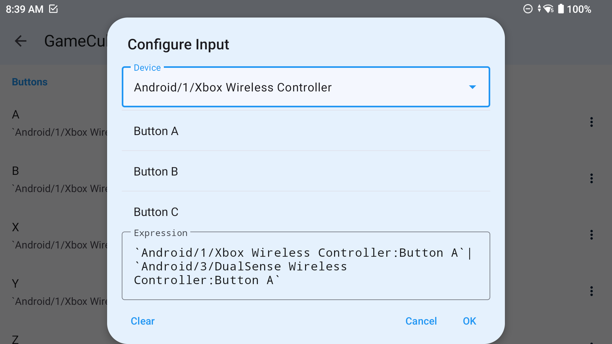
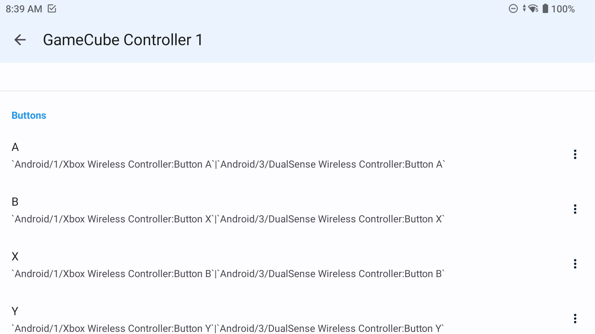

# odin-external-controller-setup

---

Work arounds to make the docking experience with the Odin2 more seamless (switch-like).

Some emulators can auto-detect controllers and configure inputs automatically (e.g. Retroarch, PPSSPP) but others require some more work to setup.

---

## AetherSX2/NetherSX2
AetherSX2 allows you to bind multiple controllers inputs to the same profile simultaneously so no profile swapping is necessary once set up 
- go to Controller Settings
- select Controller Port 1
- set up the normal Odin controller bindings if not already done
- connect external controller 
- long press on a binding
- click add new
- add your extra controller binding
- repeat for all other bindings

Now controls should be working for Odin handheld play and for external controller.

---

## Dolphin
Dolphin allows you to bind multiple controllers inputs to the same profile simultaneously so no profile swapping is necessary once set up, however this takes a little more work than for AetherSX2
- tap the settings cog
- select GameCube Input
- tap the setting cog next to GameCube Controller 1
- change device to Android/0/Virtual
- toggle on 'Create Mappings for Other Devices'
- select the 3 dots next to button A
- select your first device in dropdown
- scroll down and select Button A
- tap in the expression box to open keyboard and add a | (the vertical bar symbol acts as an OR operator in Dolphin)
- select device again and choose the external controller
- scroll down and select Button A again
- rinse and repeat for all control bindings

The expression box should then look something like this (dependent on your controller device names) when set up:
'Android/1/Xbox Wireless Controller:Button A' | 'Android/3/DualSense Wireless Controller:Button A'

---

