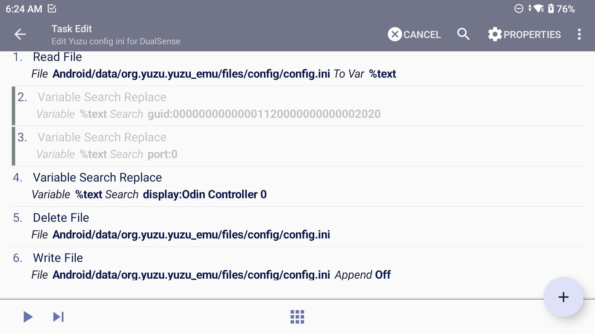

# Odin 2 External Controller Setup

---

Work arounds to make the docking experience with the Odin2 more seamless (switch-like). 
Similiar steps may work with other devices.

Some emulators can auto-detect controllers and configure inputs automatically (e.g. Retroarch, PPSSPP) but others require some more work to setup to achieve this.

---

## AetherSX2/NetherSX2/Duckstation
A(N)etherSX2/Duckstation allows you to bind multiple controllers inputs to the same profile simultaneously so no profile swapping is necessary once set up 
- go to Controller Settings
- select Controller Port 1
- set up the normal Odin controller bindings if not already done
- connect external controller 
- long press on a binding
- click add new
- add your extra controller binding
- repeat for all other bindings

Now controls should be working for Odin handheld play and for external controller.

---

## Dolphin
Dolphin allows you to bind multiple controllers inputs to the same profile simultaneously so no profile swapping is necessary once set up, however this takes a little more work than for AetherSX2
- tap the settings cog
- select GameCube Input
- tap the setting cog next to GameCube Controller 1
- change device to Android/0/Virtual
- toggle on 'Create Mappings for Other Devices'
- select the 3 dots next to button A
- select your first device in dropdown
- scroll down and select Button A
- tap in the expression box to open keyboard and add a | (the vertical bar symbol acts as an OR operator in Dolphin)
- select device again and choose the external controller
- scroll down and select Button A again
- rinse and repeat for all control bindings and a similar process can be followed for Wii input

The expression box should then look something like this (dependent on your controller device names) when set up:
'Android/1/Xbox Wireless Controller:Button A' | 'Android/3/DualSense Wireless Controller:Button A'

Example config files for [GameCube Controller](https://github.com/RobZombie9043/odin-external-controller-setup/blob/main/Dolphin/GameCube%20-%20Odin%20(xbox%20profile)%20and%20DualSense%20(Odin%20profile).ini) and [Wii Classic Controller](https://github.com/RobZombie9043/odin-external-controller-setup/blob/main/Dolphin/Wii%20Classic%20Controller%20(Odin%20(xbox%20profile)%20and%20DualSense%20(Odin%20profile)).ini)
Note these have been setup with the Odin2 using the xbox controller profile (from Odin settings menu) and a DualSense controller using the odin controller profile (from Odin settings menu). Shared ini files as an example but these would need to be changed to suit other controllers and setup configurations. 

---

## Yuzu
Yuzu does not allow binding of multiple controller inputs but does include a controller auto-mapping function but this requires you to go into the controls menu and auto-map the controller each time this is changed.

An alternative somewhat hacky work around to avoid having to auto-map the controller is to set up Tasker to trigger on a controller connection event to run a task that edits the controller details in the config.ini file that Yuzu reads.
Note this only works if Yuzu is not running as the config file is loaded on app start up.
I expect at some point this may cause issues with the config.ini file so it is probably a good idea to keep a backup of this but so far I have not run into any issues.
This is probably not worth the effort vs automapping the controller but I will share the method for general interest.

In Tasker:
- In the Profiles screen -> Click the + button to add a profile
- To set up the trigger for connection of bluetooth controller:
  - Select State -> Select Net -> Select BT connected
    - Click the magnifying glass next to Name -> Select BT Device from pop up menu
    - Click the magnifying glass next to Address -> Select BT Device from pop up menu
    - Go back
- To set up the task to change the config.ini file to use controller settings:
  - Select New Task -> Give the task a name
  - Click the + button to add an action
    - Select File -> select Read file
      - Click the magnifying glass and select the config.ini file in the following location: Android/data/org.yuzu.yuzu_emu/files/config/config.ini
      - In the To Var box add %text
      - Go back
    - Add new task -> select Variable -> select Variable Search Replace
      - Add text strings to the 'Search' and 'Replace With' boxes for what needs to be changed
      - What needs to be changed will need to be identified from the existing config.ini file - check this when Odin controller is setup and when external controller is connected to see what changes
      - e.g. for my setup the line that shows player_0_button_a="button:96,guid:00000000000001110000000000002020,port:0,display:Odin Controller 0,engine:android" changes to player_0_button_a="button:96,guid:00000000000001110000000000002020,port:0,display:DualSense Wireless Controller 0,engine:android" and similiar for other button configs
      - For the example above I needed to set the task Search to 'display:Odin Controller 0' and Replace With: 'display:DualSense Wireless Controller 0'
      - For other setups the guid number and/or port number used may also need to be changed in which case you would need to set up additional task steps for this following the same Variable Search Replace structure
    - Add new task -> select File -> select Delete File -> click magnifying glass and select the config.ini file in the following location: Android/data/org.yuzu.yuzu_emu/files/config/config.ini (this step is needed as Tasker could not overwrite the existing file without first deleting it)
    - Add new task -> select File -> select Write File -> click magnifying glass and select the config.ini file in the following location: Android/data/org.yuzu.yuzu_emu/files/config/config.ini (this step is needed as Tasker could not overwrite the existing file without first deleting it) -> in Text box add %text
  - Go back to Tasks and add a new task
- We then need to set up another task to reverse the changes made to the config.ini file on controller disconnect:
  - Follow all the steps above to set up the Task but reverese the Search and Repalce With strings to return the controls to normal for Odin handheld play 
   
Example Tasker Project file for compeleting the [Yuzu config ini changes](https://github.com/RobZombie9043/odin-external-controller-setup/blob/main/Yuzu/Yuzu_ini.prj.xml)
The BT address and Search and Replace With commands would need to be modified to suit other controllers and setup configurations. 

---

## Other configurations I use (personal preference)

### Android Key layout files
In Android, most peripheral inputs, whether physical or virtual, are translated into actions defined by keymap, a small file that names the functions for each device input, including system inputs and gamepads or conventional keyboards. [1](https://medium.com/@ManoelFreitas/android-what-are-kl-files-and-how-to-use-them-to-map-a-gamepad-10201f30a3fb)

On the Odin, if you have selected the Controller Style (Settings > Odin settings > Controller style) as either Odin or Xbox when connecting a BT controller then the key layout file that is used for the controller is an Odin specific one (Vendor_2020).

If however the Controller style is first changed to disconnected and then you connect a controller it will use the correct controller key layout file for the controller (only tested with PS DualSense - Vendor_054c).

Why is this important?
- When connected with the correct key layout file, the ABXY (or cross, circle, triangle, square) buttons work in the correct layout rather than being reversed. Subsequently changing the controller style does not affect the controller buttons, they continue to work correctly.
- Vibration is supported for the controller when connected in this way

I use Tasker to automate this process by setting up an event that triggers on BT connection of my controller and then changes Controller Style to disconnect.

I switch to digital triggers for some emulators that prefer them (e.g. yuzu/winlator). I do this with Tasker but this could also be done with [OdinTools](https://github.com/langerhans/OdinTools).

Example Tasker project file used for all the above automations - [Tasker Controller project](Tasker/Controller.prj.xml)

Specifics would need to be modified to match other controllers and setup configurations.

### Key Mapper
I use [Key Mapper](https://play.google.com/store/apps/details?id=io.github.sds100.keymapper&hl=en&gl=US) to map shortcuts to my controller. I.e. I uses a double press of the PS button mapped to the 'Android Back' command. In most standalone emulators this then opens the emulator menu. 
- Go back: Trigger - Double press Button Mode (DualSense Wireless Controller); Actions - Go back

I have also set up the back button on the Odin to work as a double tap to open recents menu and long press to clear all running tasks (thanks to Standard-Pepper-6510 on reddit).
- Open recents: Trigger - Double press back; Actions - Open recents
- Clear all running tasks: Trigger - Long press back; Actions - Open recents, wait 250ms, Tap coordinates 1140, 915
